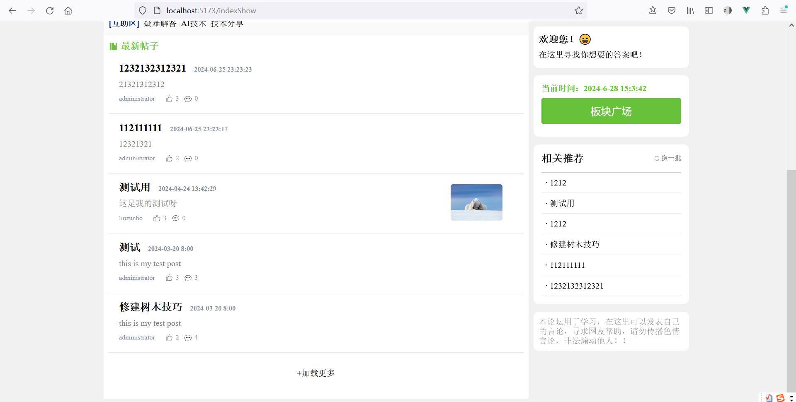
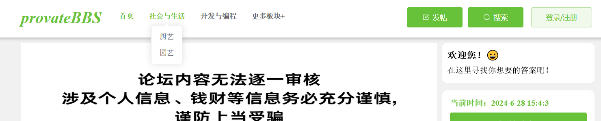
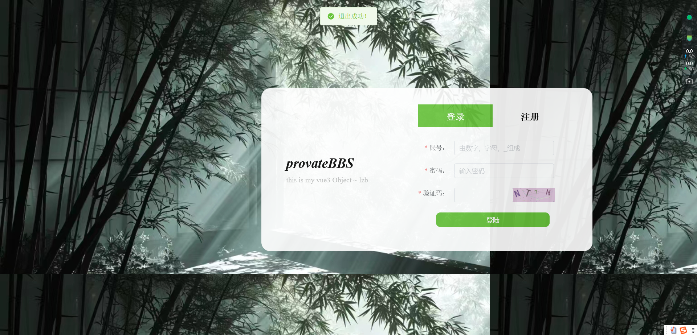
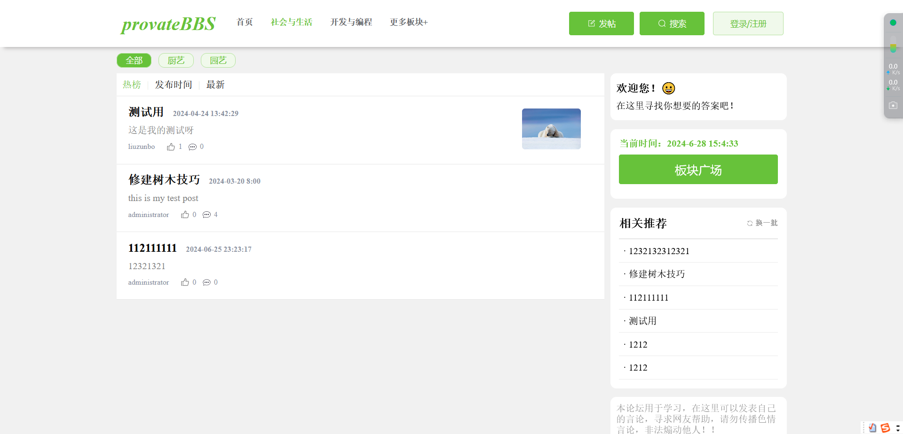
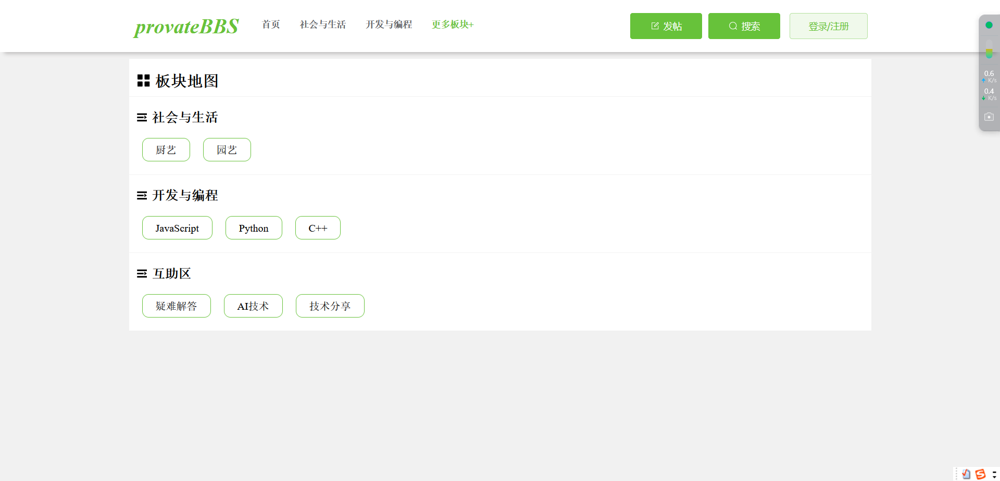
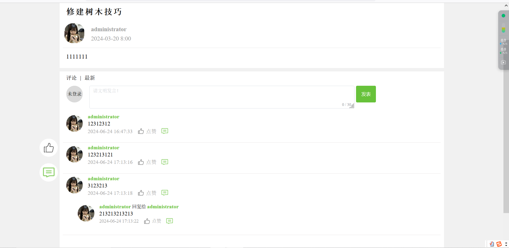
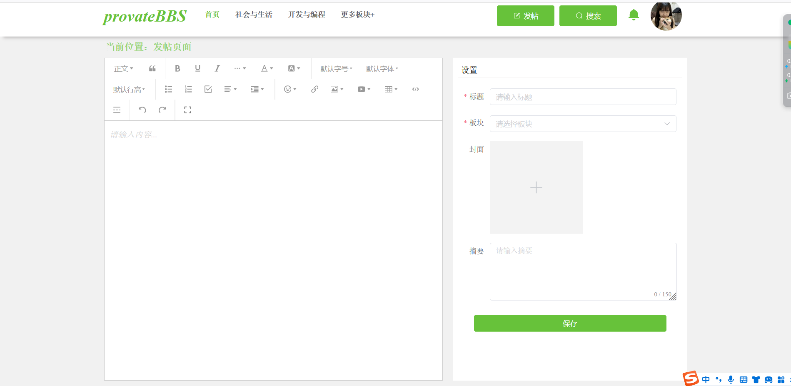
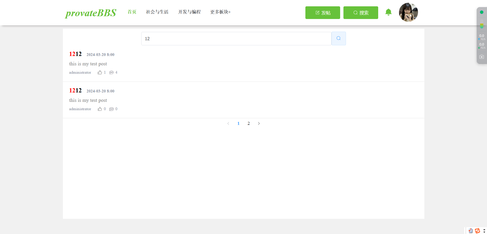
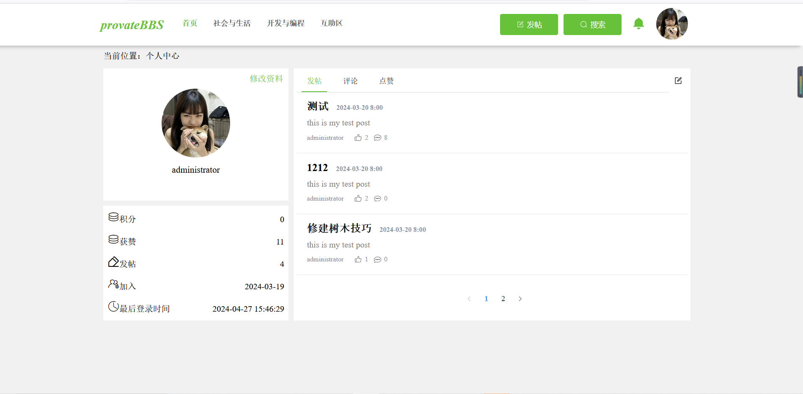
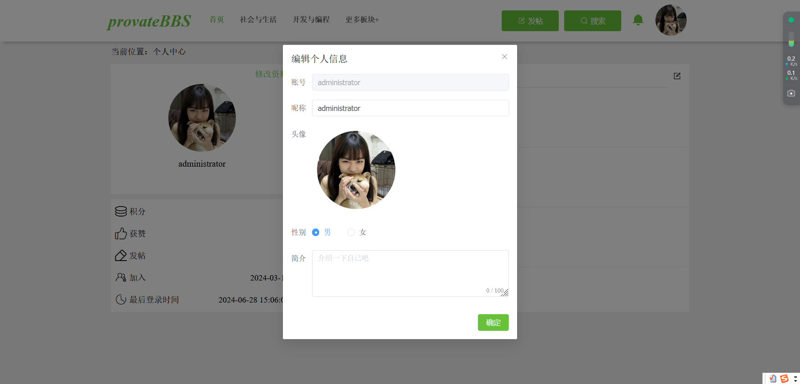

# 前言

此项目是仿照其他论坛项目制作出来，实现了简单的查看帖子，发表帖子，登录，注册，删除评论，点赞评论，点赞帖子的功能。

## 项目功能

在前端使用vue3构建项目，用户能够发表帖子，评论帖子，对他人的帖子进行评论，点赞操作，别人点赞最自己发表的帖子会在消息列表中出现，可以删除自己已发表的评论

通过jwt进行权限验证，检测用户是否登陆

通过axios的二次封装，api模块化，对请求连接进行分类管理

通过路由守卫，对用户是否登录进行检测

创建项目时使用的版本是 node - v20.11.0 npm - 10.2.4

## 技术栈

vue3 + vite + pinia + vue-router + element-plus + sass  + wangEditor

## 项目运行

```
git clone https://github.com/lzb1015/provate-bbs.git

cd provate-bbs

yarn install

//运行源代码项目
yarn dev

//运行打包后的项目
yarn start
```

## 页面展示

项目中有存在一个默认用户 (默认用户是server端中sql创建的 )

账号： administrator

密码 ： 123456

#### 首页






#### 登录页面



#### 板块页面





#### 帖子详情页面



#### 发帖页面



#### 搜索页面



#### 用户个人中心



#### 用户修改页面




## PS

新手做的项目，很多地方都不足

provateBBS 项目地址：https://github.com/lzb1015/provate-bbs

provateBBS-server 项目地址：https://github.com/lzb1015/provate-bbs-server

provate-bbs-admin 项目地址：https://github.com/lzb1015/provate-bbs-admin

